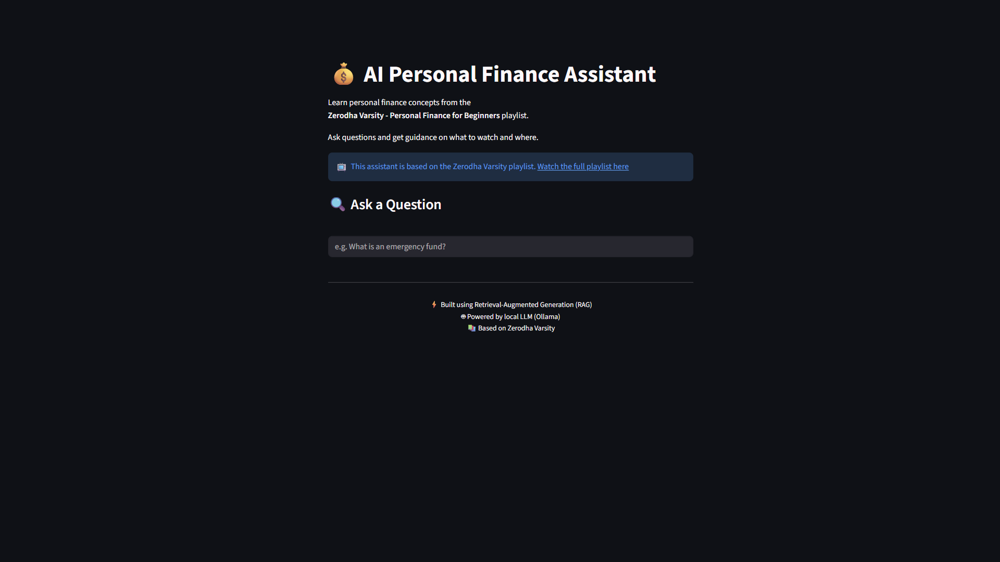
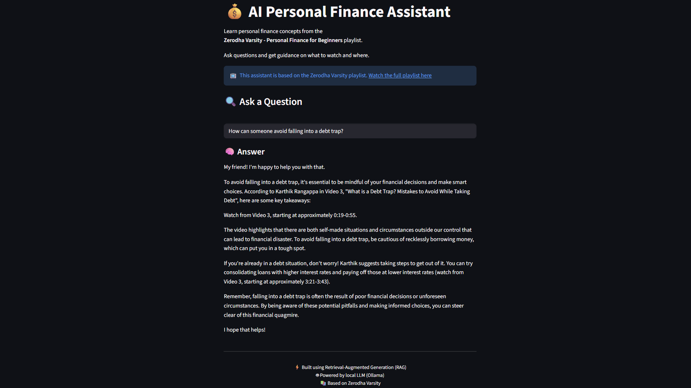

# AI Personal Finance Assistant

Built using Retrieval-Augmented Generation (RAG) with local LLMs.

This project is a simple AI assistant that answers questions from the  
**Zerodha Varsity – Personal Finance for Beginners** YouTube playlist.

👉 [Watch the playlist](https://youtube.com/playlist?list=PLX2SHiKfualHj_3Ms2t8cCd9tUpQHA9MW&si=gBp61ZcqpARH-ySS)

Instead of searching through videos manually, you can just ask a question  
and the app will guide you to the exact part of the video where the concept is explained.

---

##  Preview




---

## What it does

- Lets you ask questions related to personal finance
- Finds the most relevant parts from the course videos
- Gives a simple explanation
- Tells you **which video and timestamp to watch**

---

## How it works (in short)

- Video → converted to audio  
- Audio → converted to text (transcripts)  
- Text → split into chunks  
- Chunks → converted into embeddings  
- When you ask a question:
  - It finds the most relevant chunks
  - Sends them to a local LLM (llama 3)
  - Generates a clean answer

---

## Setup

### 1. Install Python dependencies
pip install -r requirements.txt


---

### 2. Install FFmpeg (required)

Download from: https://ffmpeg.org/download.html  

After installing, make sure it is added to your system PATH.

Check: ffmpeg -version


---

### 3. Install Ollama

Download from: https://ollama.com  

---

### 4. Pull required models
```
ollama pull llama3
ollama pull bge-m3
```

---

### 5. Start Ollama
```
ollama serve
```

---

## Run the app
```
streamlit run app.py
```

---

## Example questions

- What is an emergency fund?
- Where in the course is asset allocation explained?
- How can someone avoid falling into a debt trap?

---

## 📁 Project structure
```
RAG-Finance-Assistant/
│
├── app.py
├── process_incoming.py
│
├── data/
│ └── embeddings.joblib
│
├── scripts/
│ ├── video_to_mp3.py
│ ├── mp3_to_json.py
│ ├── merge_chunks.py
│ └── preprocess_json.py
```


---

## Notes

- This runs completely locally (no API cost)
- First-time setup may take time (model downloads)
- Requires a decent CPU for smooth performance

---

## 🙌 Credits

- Zerodha Varsity (content)
- Ollama (local LLM)
- Whisper (speech-to-text)